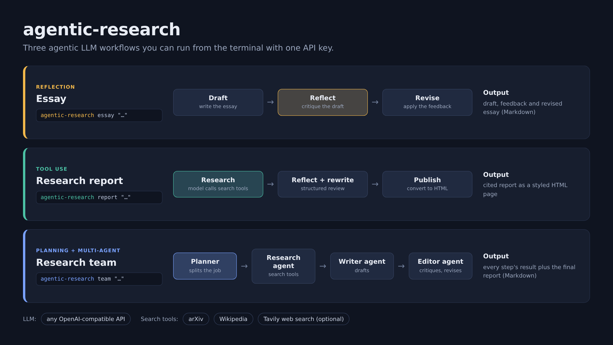

# agentic-research

Three agentic LLM workflows, runnable from the terminal with a single API key.



| Command | Pattern | What happens |
| --- | --- | --- |
| `essay` | Reflection | The model drafts an essay, critiques its own draft, then revises it. |
| `report` | Tool use | The model searches arXiv, Wikipedia and the web, writes a cited report, reviews and rewrites it, then publishes it as HTML. |
| `team` | Planning + multi-agent | A planner splits the job into steps and hands each one to a research, writer or editor agent. |

## Quick start

Requires Python 3.10+.

```bash
git clone <your-repo-url> && cd agentic-research
python -m venv .venv && source .venv/bin/activate   # Windows: .venv\Scripts\activate
pip install -e .
cp .env.example .env                                # then put your API key in .env
```

Run a workflow:

```bash
agentic-research essay  "Should social media platforms be regulated by the government?"
agentic-research report "Radio observations of recurrent novae"
agentic-research team   "The ensemble Kalman filter for time series forecasting"
```

Results are written to `outputs/<workflow>-<topic>/`.

## Configuration

All settings live in `.env`:

| Variable | Required | Purpose |
| --- | --- | --- |
| `LLM_API_KEY` | yes | API key for the LLM provider (`OPENAI_API_KEY` also works). |
| `LLM_MODEL` | no | Model name. Default `gpt-4o-mini`. |
| `LLM_BASE_URL` | no | Set to use any OpenAI-compatible provider (OpenRouter, Ollama, ...). |
| `TAVILY_API_KEY` | no | Enables general web search. Without it, arXiv and Wikipedia are used. |
| `OUTPUT_DIR` | no | Where results are saved. Default `outputs`. |

The `report` and `team` workflows need a model that supports tool calling.

## Project layout

```
src/agentic_research/
├── cli.py            command line entry point; saves results to disk
├── config.py         reads settings from .env
├── llm.py            the only module that calls the LLM API (incl. the tool-calling loop)
├── parsing.py        cleans up JSON / code fences in model answers
├── tools/
│   ├── base.py       the Tool dataclass
│   ├── http.py       shared HTTP session with retries
│   ├── arxiv.py      arXiv paper search
│   ├── wikipedia.py  Wikipedia summaries
│   └── tavily.py     web search (optional)
└── workflows/
    ├── essay.py      draft -> reflect -> revise
    ├── report.py     research with tools -> reflect + rewrite -> HTML
    └── team.py       planner -> research / writer / editor agents
```

Each workflow is a plain function that takes an `LLM` and returns a dataclass,
so it can also be used from Python:

```python
from agentic_research.config import load_settings
from agentic_research.llm import LLM
from agentic_research.workflows import run_essay

result = run_essay(LLM(load_settings()), "Is remote work here to stay?")
print(result.revised)
```

## Extending

- **New tool:** write a function, wrap it in a `Tool` (see `tools/arxiv.py`), add it to `build_tools` in `tools/__init__.py`.
- **New workflow:** add a module in `workflows/` with a `run_*` function and register a subcommand in `cli.py`.

## Notes

LLM output is not deterministic, and models can misreport sources. Check citations before relying on a report.
